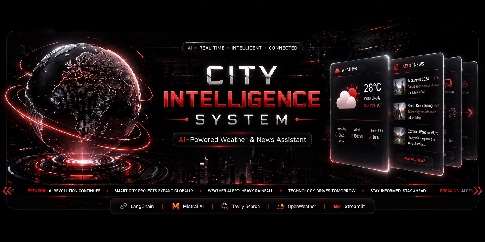

<p align="center">
  
</p>

<div align="center">

# 🌍 City Intelligence System

### 🤖 AI-Powered Weather & News Assistant

An intelligent AI assistant built with **LangChain**, **Mistral AI**, **Tavily Search**, **OpenWeather API**, and **Streamlit**.

<p align="center">
  
  
  
  
  
  
</p>

<p align="center">
  <a href="https://credit-card-fraud-detection-tvae-iasu9sznd9gn2py4du8frd.streamlit.app/">
    
  </a>
  <a href="https://github.com/yashvi-data-analyst/city-intelligence-system">
    
  </a>
</p>

</div>

---

# ✨ Features

- 🌤 Real-Time Weather
- 📰 Latest News Search
- 🤖 AI Chat with Mistral
- 🔎 Tavily Search Integration
- ⚡ LangChain Agent Workflow
- 🛡 Human Approval Middleware
- 💬 Streamlit Interface
- 📥 Download Chat
- 📊 Conversation Statistics

---

# 📸 Project Preview

## 🏠 Home Page

<p align="center">

</p>

## 🌤 Weather Response

<p align="center">

</p>

## 📰 News Response

<p align="center">

</p>

## 📋 Sidebar

<p align="center">

</p>

---

# 🛠 Tech Stack

| Technology | Purpose |
|------------|---------|
| Python | Backend |
| Streamlit | UI |
| LangChain | AI Agent |
| Mistral AI | LLM |
| Tavily | Web Search |
| OpenWeather API | Weather Data |

---

# 📂 Project Structure

```text
city-intelligence-system/
├── app.py
├── Agents.py
├── requirements.txt
├── README.md
└── assets/
    ├── banner.png
    ├── HomePage.png
    ├── Weather_response.png
    ├── news_response.png
    └── sidebarfeatures.png
```

---

# ⚙ Installation

```bash
git clone https://github.com/yashvi-data-analyst/city-intelligence-system.git
cd city-intelligence-system
pip install -r requirements.txt
streamlit run app.py
```

---

# 🔑 Environment Variables

```env
MISTRAL_API_KEY=YOUR_KEY
OPENWEATHER_API_KEY=YOUR_KEY
TAVILY_API_KEY=YOUR_KEY
```

---

# 🚀 Future Improvements

- 📍 Auto Location
- 🌍 Multi-language
- 🔊 Voice Assistant
- 📈 Weather Forecast
- ❤️ Favorite Cities

---

# 👩‍💻 Author

**Yashvi Verma**

GitHub: https://github.com/yashvi-data-analyst

---

# ⭐ Support

If you like this project, please ⭐ star the repository.

<div align="center">

### ❤️ Made with Streamlit • LangChain • Mistral AI

</div>
