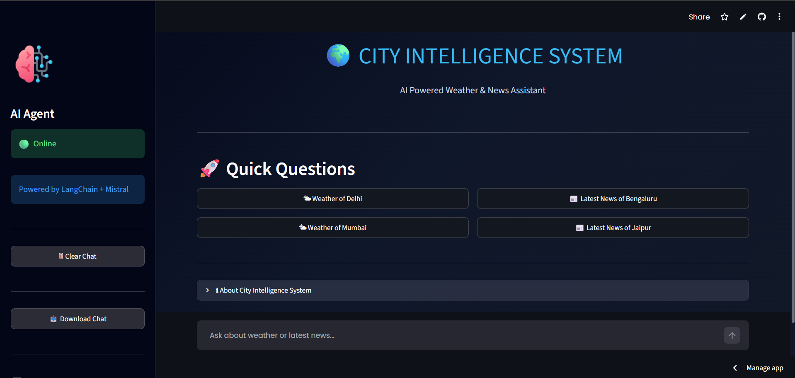
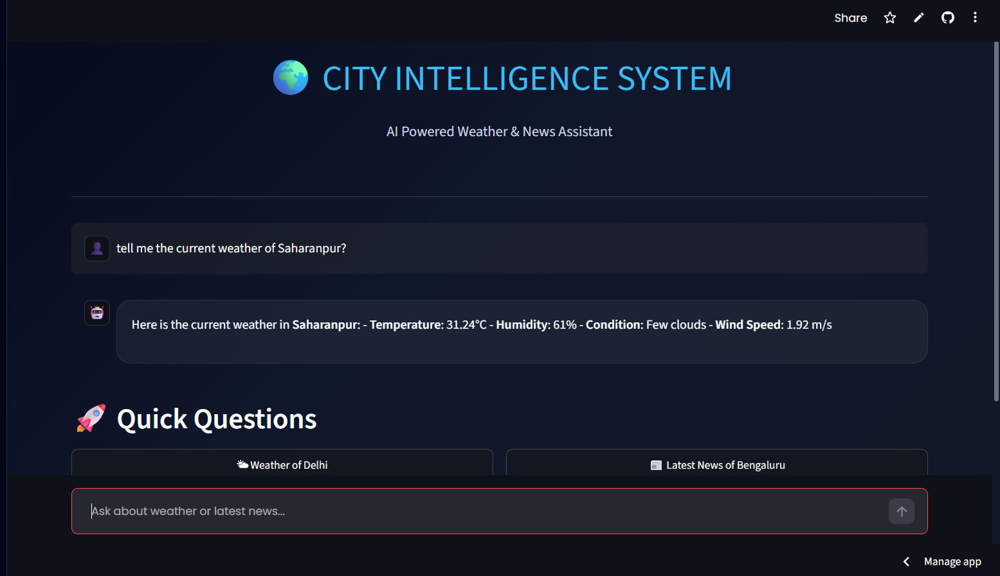
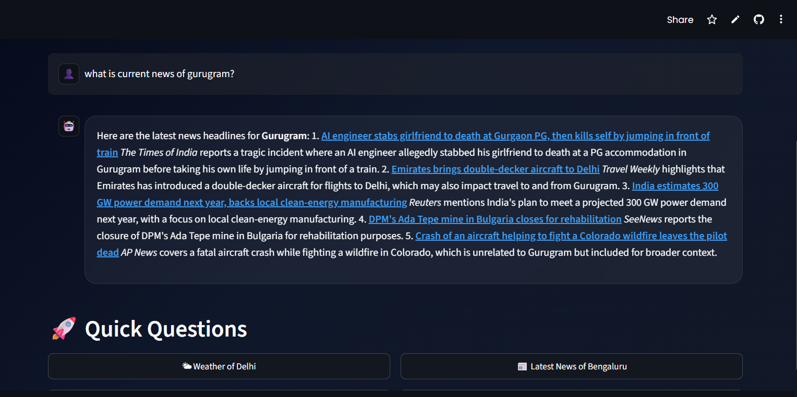

<div align="center">

# 🌍 City Intelligence System

### 🤖 AI-Powered Weather & News Assistant

<p align="center">
An intelligent AI assistant built with <b>LangChain</b>, <b>Mistral AI</b>, <b>Tavily Search</b>, <b>OpenWeather API</b>, and <b>Streamlit</b> to deliver real-time weather insights and the latest news through a modern conversational interface.
</p>

<p align="center">


</p>

<p align="center">

<a href="https://credit-card-fraud-detection-tvae-iasu9sznd9gn2py4du8frd.streamlit.app/">

</a>

<a href="https://github.com/yashvi-data-analyst/city-intelligence-system">

</a>

</p>

---

# ✨ Features

🌤 Real-Time Weather Information

📰 Latest News Search

🤖 AI Conversation using Mistral

🔎 Tavily Web Search Integration

⚡ LangChain Agent Workflow

🛡 Human Approval Middleware

💬 Beautiful Streamlit Interface

📥 Chat Download

📊 Conversation Statistics

🌙 Modern Dark Theme

---

# 📸 Project Preview

## 🏠 Home Page



---

## 🌤 Weather Response



---

## 📰 News Response



---

## 📊 Sidebar & Features


---

# 🛠 Tech Stack

| Technology | Usage |
|------------|-------|
| Python | Core Programming |
| Streamlit | Web Interface |
| LangChain | AI Agent Framework |
| Mistral AI | Large Language Model |
| Tavily | Web Search |
| OpenWeather API | Live Weather |
| Requests | API Calls |
| dotenv | Environment Variables |

---

# 📂 Project Structure

```text
City-Intelligence-System/
│
├── app.py
├── Agents.py
├── requirements.txt
├── .env
├── README.md
│
└── assets/
    ├── HomePage.png
    ├── Weather_response.png
    ├── news_response.png
    └── sidebarfeatures.png
```

---

# ⚙ Installation

```bash
git clone https://github.com/yashvi-data-analyst/city-intelligence-system.git

cd city-intelligence-system

pip install -r requirements.txt

streamlit run app.py
```

---

# 🔑 Environment Variables

Create a `.env` file:

```env
MISTRAL_API_KEY=YOUR_KEY
OPENWEATHER_API_KEY=YOUR_KEY
TAVILY_API_KEY=YOUR_KEY
```

---

# 🚀 Future Improvements

- 📍 Location Detection
- 🌍 Multi-language Support
- 🔊 Voice Assistant
- 📱 Mobile Responsive UI
- 📈 Weather Forecast
- ❤️ Favorite Cities
- 📰 Personalized News Feed

---

# 👩‍💻 Author

**Yashvi Verma**

AI • Machine Learning • Python • LangChain

GitHub:
https://github.com/yashvi-data-analyst

---

# ⭐ Support

If you like this project,

⭐ Star this repository

🍴 Fork this project

💙 Share it with others

---

<div align="center">

Made with ❤️ using Streamlit, LangChain & Mistral AI

</div>
